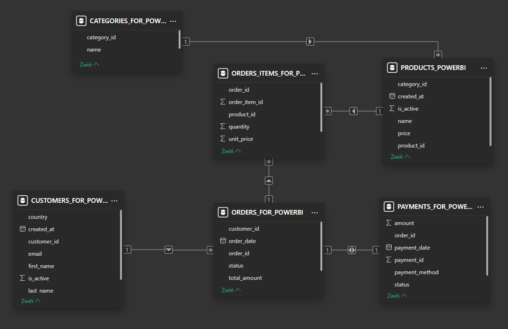

# SQL Store Sales Analysis
End-to-end data analysis project using SQL and Power BI to analyze e-commerce sales performance.

## Project Overview
This project presents an end-to-end data analysis workflow using SQL and Power BI.
The goal of the project was to simulate a real e-commerce database and perform analytical queries to extract business insights.

## Tools Used
SQL  
Power BI  
Git & GitHub

## Data
The project includes two datasets:
- Raw generated data used to simulate the e-commerce database
- CSV exports used in the Power BI dashboard

## Database Structure
The database contains the following tables:
- customers
- orders
- order_items
- products
- categories
- payments

## Analysis Performed

### Customer Analysis
- Top 5 customers by total spending
- Revenue generated per country
- Customers who purchased the most products within each category

### Product Analysis
- Top 5 best-selling products
- Products generating the highest revenue
- Slow-moving products with low sales

### Category Analysis
- Top revenue-generating categories

### Time Analysis
- Monthly revenue trends
- Year-over-year revenue growth

## Power BI Dashboard
The project also includes a Power BI dashboard presenting:
- Total revenue
- Total orders
- Total Customers
- Revenue by category
- Revenue trend
- Top 10 products
- Country filter

## Project Structure
- data - generated datasets used in the analysis
- data_powerbi - generated datasets used in Power BI
- sql - SQL scripts for database creation and analytical queries  
- powerbi - Power BI dashboard file  
- images - dashboard preview image

## Author
Data analysis portfolio project created to practice SQL data analysis and data visualization.

## Dashboard Preview

## Relationships between tables Preview

This diagram shows the relationships between all tables used in the project.