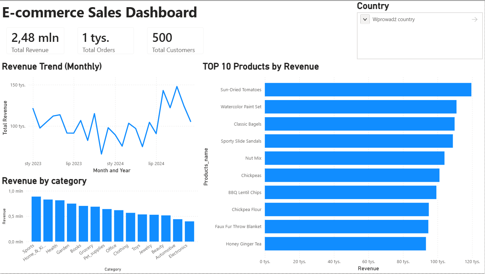

# SQL Store Sales Analysis

## Project Overview
This project presents an end-to-end data analysis workflow using SQL and Power BI.
The goal of the project was to simulate a real e-commerce database and perform analytical queries to extract business insights.

## Tools Used
SQL  
Power BI  
Git & GitHub

## Data
The project includes two datasets:
- Raw generated data used to simulate the e-commerce database
- CSV exports used in the Power BI dashboard

## Database Structure
The database contains the following tables:
- customers
- orders
- order_items
- products
- categories
- payments

Relationships between tables are presented in the schema diagram.

## Analysis Performed
Examples of analytical queries:
- Top customers by total spending
- Revenue per country
- Best selling products
- Monthly revenue trends
- Payment method distribution

## Power BI Dashboard
The project also includes a Power BI dashboard presenting:
- Total revenue
- Revenue by country
- Revenue by category
- Top customers
- Sales trends

## Files in Repository
SQL scripts – database creation and analytical queries  
CSV files – generated datasets  
Power BI file – interactive dashboard  
Schema diagram – database structure visualization

## Author
Data analysis portfolio project created to practice SQL data analysis and data visualization.

## Dashboard Preview
