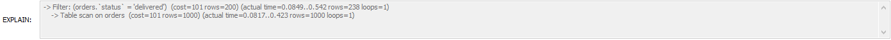
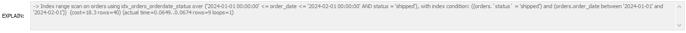
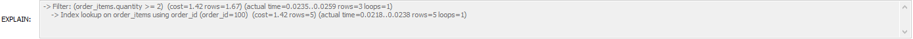
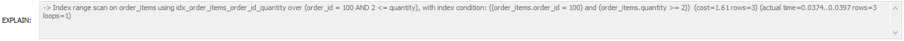

# SQL Store Sales Analysis
End-to-end data analysis project using SQL and Power BI to analyze e-commerce sales performance.

## Project Overview
This project presents an end-to-end data analysis workflow using SQL and Power BI.
The goal of the project was to simulate a real e-commerce database and perform analytical queries to extract business insights.

## Tools Used
SQL  
Power BI  
Git & GitHub

## Data
The project includes two datasets:
- Raw generated data used to simulate the e-commerce database
- CSV exports used in the Power BI dashboard

## Database Structure
The database contains the following tables:
- customers
- orders
- order_items
- products
- categories
- payments

## Analysis Performed

### Customer Analysis
- Top 5 customers by total spending
- Revenue generated per country
- Customers who purchased the most products within each category

### Product Analysis
- Top 5 best-selling products
- Products generating the highest revenue
- Slow-moving products with low sales

### Category Analysis
- Top revenue-generating categories

### Time Analysis
- Monthly revenue trends
- Year-over-year revenue growth

## Index Optimization
To improve query performance, indexes were applied and tested using EXPLAIN ANALYZE.

### Case 1: Filtering by order status
Query:
SELECT * FROM orders WHERE status = 'delivered';
- Before: full table scan (type: ALL)

- After: index lookup using idx_status

Result:
Reduced scanned rows and lower query cost, improving performance.

### Case 2: Composite index (order_date, status)
Query:
SELECT * FROM orders
WHERE status = 'shipped'
AND order_date BETWEEN '2024-01-01' AND '2024-02-01';
- Before: full table scan (type: ALL)

- After: index range scan using composite index

Result:
Reduced scanned rows and improved query efficiency.

### Case 3: Composite index on order_items
Query:
SELECT * FROM order_items
WHERE order_id = 100 AND quantity >= 2;
- Before: index lookup on order_id with additional filtering on quantity

- After: index range scan using composite index

Result:
Indexes reduced scanned rows and improved query performance.

Execution plans confirmed the transition from table scans to index-based operations.

## Power BI Dashboard
The project also includes a Power BI dashboard presenting:
- Total revenue
- Total orders
- Total Customers
- Revenue by category
- Revenue trend
- Top 10 products
- Country filter

## Project Structure
- data - generated datasets used in the analysis
- data_powerbi - generated datasets used in Power BI
- sql - SQL scripts for database creation and analytical queries  
- powerbi - Power BI dashboard file  
- images - dashboard preview image

## Author
Data analysis portfolio project created to practice SQL data analysis and data visualization.

## Dashboard Preview

## Relationships between tables Preview

This picture shows the relationships between all tables used in the project.